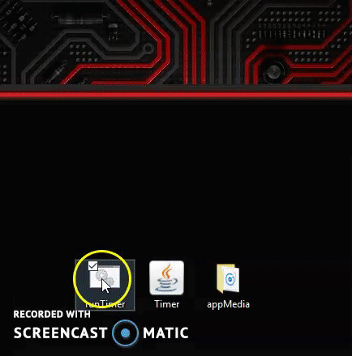

# Why I Built This App
One of my teachers needed a simple timer app to display over presentation slides so that students could view important content and the timer when taking tests that involve Long-Essay Questions and Documnent-Based Questions. Although I could've downloaded a timer app for him, I wanted to create my very own timer with JavaFX!

# What it Does
When the application launches, the user is requested to input a number of minutes for the timer to start from when counting down. Additionally, an image of choice is displayed if a file named "displayImage.jpg" is located within the "appMedia" folder that is located in the same directory as the jar file. Otherwise, the app will not stop working if there is no such file in your directory. After clicking the next button, the user is redirected to the actual timer UI, which displays the number of minutes and seconds lefts as well as "start", "stop", "restart", and "back" buttons. Clicking the "start" button enables the timer. Clicking the "stop" button pauses the timer so that the timer can be resumed by pressing the "start" button again. Clicking the "restart" button resets the timer to the number of minutes the user input at the beginning. Finally, clicking the "back" button takes the user back to the welcome screen where he/she can input a different quantity of minutes. Once the timer reaches 0 minutes and 0 seconds, the timer stops and sounds an alarm if there is an mp3 file named "timerSound" located in an appMedia folder from which the application is launched. For example, if you put the jar file in your desktop folder and have an "appMedia" folder in your desktop folder with "timerSound.mp3" in it, then the sound should play. Otherwise, the app will not stop working if there is no such file in your directory. See the README in the Run Timer folder for more instructions on launching the timer!

# Brief Functionality Overview
- Input # of minutes
- Click start to enable timer (and timer turns green)
- Click stop to disable timer (and timer turns red)
- Click reset to reset timer (and timer turns grey)
- When timer reaches 0, alarm sound is played (with the limitations described above)
- Display image shows on welcome screen
- Resizable screen
- Timer always stays on top of other applications (even if you click out of it)
- Simple and easy-to-use GUI (JavaFX)
